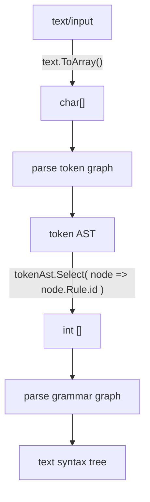

Rule graph
==========

All rules are collected in a rule graph. Generally (well specifically in gg.parse) these graphs come in two flavors: 

1) Token Graphs which work on `char[]` and produce ... tokens. 
2) Grammar Graphs which consume the tokens produced by a token graph in the form of `int[]` (referring to the token ids) and produces an abstract syntax tree (ast or syntax tree in short). 

Details sometimes matter, so to be specific: both token - and grammar graphs implement the `RuleGraph<T>` where the token graph is a `RuleGraph<char>` and the grammar graph `RuleGraph<int>`. Both graphs produce an AST in the form of an `Annotation` collection. To get from an token-AST to an int array which the grammar graph uses, we take the top level annotations in the token-AST and map the associated rule ids to an int array.



The entry point, the first rule executed when parsing, in a graph is the `Root`. Parsing is a text using a graph is a matter of taking the root and calling Parse using the required data array and a start point, eg

```csharp
    var tokenGraph = new RuleGraph<char>();
    // ... add token rules
    tokenGraph.Root = // pick a Root from the tokenGraph
    var text = "some text to parse";
    char[] textData = text.ToArray();
    var tokenAst = tokenGraph.Parse(textData);

    var grammarGraph = new RuleGraph<int>();
    // ... add grammar rules
    grammarGraph.Root = // pick a Root from the grammarGraph 

    int[] tokens = tokenAst.SelectRuleIds();
    var syntaxTree = tokenGraph.Parse(tokens);

    // ... have fun with the syntax tree
```

When composing a graph this way, you will need to set the Root explicitely (or pick a rule from the graph to start parsing with, eg `tokenGraph.FindRule("my_root").Parse(textData, 0)`). When creating a graph from script there are two ways to define a root. The preferred way is to define a rule in the top level script with the name `root`. Eg:

```csharp
// see gg.parse.doc.examples.test.RootTests
var tokenizerWithExplicitRoot = new ParserBuilder().From("foo = 'foo'; root = 'bar', foo;");

// 'root' is the starting rule so the first example should succeed. 
// The second, which is captured by the 'foo' rule should fail as foo is NOT the starting rule
IsTrue(tokenizerWithExplicitRoot.Tokenize("barfoo"));
IsFalse(tokenizerWithExplicitRoot.Tokenize("foo"));
```

Alternatively, you can omit naming a rule 'root', and assuming you use the `ParserBuilder`, the ParserBuilder will pick the _first_ rule encountered in the top-level script. Eg:

```csharp
// see gg.parse.doc.examples.test.RootTests
var tokenizerWithDefaultRoot = new ParserBuilder().From("foo = 'foo'; bar = 'bar', foo;");

// foo is the first rule and there is not 'root' rule, so foo will become the root
IsTrue(tokenizerWithDefaultRoot.Tokenize("foo"));
IsFalse(tokenizerWithDefaultRoot.Tokenize("barfoo"));
```