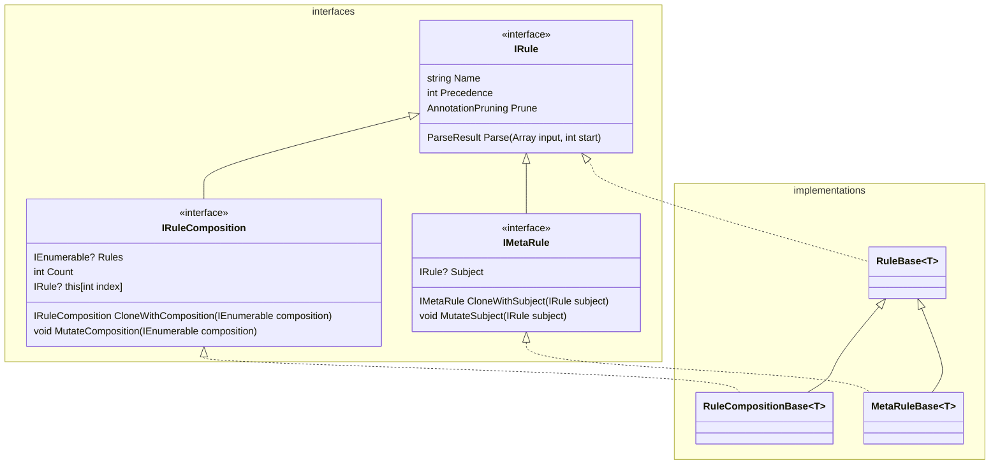

Rules
=====

The rules making up the tokenizer and parser come in three types:

* Data rules, rules which parse the input. Eg, parsing a literal.
* Meta rules, rules which use one other rule to determine the outcome of their Parse operation. Eg parse one or more literals. 
* Rule compositions, rules which use zero or more other rules, eg parse a sequence of a literal, followed by another literal.

These types are implemented as:

### Categories by use-case

The rules implementations come in the following categories:

#### Data rules

Parse the data either characters or token.

* [MatchAnyData](./match-any-data.md)
* [MatchDataRange](./match-data-range.md)
* [MatchDataSequence](./match-data-sequence.md)
* MatchDataSet
* MatchSingleData

#### Meta rules (IMetaRule)

Return a result based on the outcome of its subject.

* [MatchCount](./match-count.md) 

#### Look ahead rules (IMetaRule)

Return a result based on the outcome of its subject, but do not change the data pointer.

* [MatchCondition](./match-condition.md)
* [MatchNot](./match-not.md)
* [SkipRule](./skip_rule.md)

#### Sequences (IRuleComposition)

Return the result based on whether all subrules succeed in a specific order

* MatchSequence

#### Options (IRuleComposition)

Return the results based on if one of the subrules succeed

* MatchOneOf
* [MatchEvaluation](./match-evaluation.md)

#### Misc

* Callback
* Log
* [RuleReference](./rule-reference.md)

