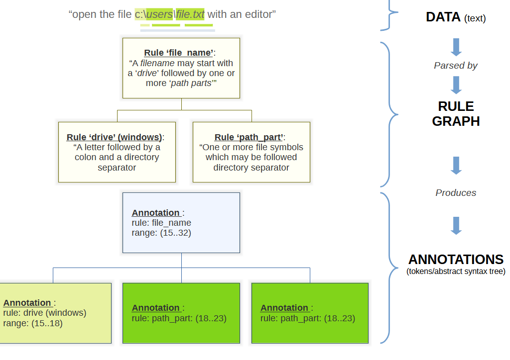

gg.parse 
=======================================================================================================================

!_Please Note_! the code base is under development and changes frequently. The documentation below may be out of date.

License
-------

[MIT](./license)

Quickstart
-----------------------------------------------------------------------------------------------------------------------

The goal of the gg.parse project is to provide a library for a tokenization, parsing and offer an ebnf-like scripting 
tools to make parsing of simple and complex data easy to do, both programatically and via an interpreted scripting 
language. Furthermore this project aims to provide an _easy to understand and use, light-weight_ framework.

Core concepts:

- A `_Rule_` implements a function to parse data (text) and create one or more `_Annotations_`.
- An `_Annotation_` describes what data is intended to mean, as expressed by a rule. An annotation describes a specific 
  part of the data by way of a `_Range_`. A range a position in the data and its length. Furthermore an annotation is a 
  tree-node where its children may give further insight in the details of data in question.
- A collection of `Rules` make up a `_Rule Graph_`. A `Rule Graph` can _parse_ data (commonly, but not necessarily 
  text)  and map the data to one or more `Annotations`. Depending on the use case, the collection of `Annotations` 
  can either be used as `Tokens` or an `Abstract Syntax Tree`.



Extended concepts:

- A set of common rules (literal, sequence, not...) to quickly build tokenizers and parsers. 
- A tokenizer/parser/compiler which can build a tokenizer and or parser based on a high-level ebnf-like script.
- A facade-like class, `gg.parse.script.ParserBuilder`, which combines all of the above in a single convenient class.

## Example

Programmatically create a tokenizer to tokenizer (simplified) filenames in a text (see 
`gg.parse.doc.examples.test\CreateFilenameTokenizer.cs`):

```csharp
        public class FilenameTokenizer : CommonTokenizer
        {
            public FilenameTokenizer()
            {
                var letter = OneOf(UpperCaseLetter(), LowerCaseLetter());
                var number = InRange('0', '9');
                var specialCharacters = InSet("_-~()[]{}+=@!#$%&'`.".ToArray());
                var separator = InSet("\\/".ToArray());
                var drive = Sequence("drive", letter, Literal(":"), separator);
                var pathPart = OneOrMore("path_part", OneOf(letter, number, specialCharacters));
                var pathChain = ZeroOrMore("#path_chain", Sequence("#path_chain_part", separator, pathPart));
                var path = Sequence("path", pathPart, pathChain);
                var filename = Sequence("filename", drive, path);
                var findFilename = Skip(filename, failOnEoF: false);

                Root = OneOrMore("#filenames", Sequence("#find_filename", findFilename, filename));
            }
        }

        ...

        var filename = "c:\\users\\text.txt";
        var data = $"find the filename {filename} in this line.";           
        var tokens = new FilenameTokenizer().Tokenize(data);
            
        IsTrue(tokens[0].GetText(data) == filename);

        IsTrue(tokens[0] == "filename");
        IsTrue(tokens[0][0] == "drive");
        IsTrue(tokens[0][1] == "path");
        IsTrue(tokens[0][1][0] == "path_part");
        IsTrue(tokens[0][1][1] == "path_part");
```

Doing the same using a script (see `gg.parse.doc.examples.test\CreateFilenameTokenizer.cs`):

```csharp

    public static readonly string _filenameScript =
        "#filenames         = +(find_filename, filename);\n" +
        "~find_filename     = >>> filename;\n" +
        "filename           = drive, path;\n" +
        "drive              = letter, ':', separator;\n" +
        "path               = path_part, *(~separator, path_part);\n" +
        "path_part          = +(letter | number | special_character);\n" +
        "letter             = {'a'..'z'} | {'A'..'Z'};\n" +
        "number             = {'0'..'9'};\n" +
        "separator          = {'\\\\/'};\n" +
        "special_character  = {\"_-~()[]{}+=@!#$%&`.'\"};\n";

    ...

    var filename = "c:\\users\\text.txt";
    var data = $"find the filename {filename} in this line.";
    var tokens = new ParserBuilder().From(_filenameScript).Tokenize(data);

    IsTrue(tokens[0].GetText(data) == filename);

    IsTrue(tokens[0] == "filename");
    IsTrue(tokens[0][0] == "drive");
    IsTrue(tokens[0][1] == "path");
    IsTrue(tokens[0][1][0] == "path_part");
    IsTrue(tokens[0][1][1] == "path_part");
```

Project structure
-----------------

The project consists of 3 main topics:

1. Core: Core classes (eg IRule, RuleGraph and Annotation) as well as the basic rules (eg Sequence, Data matchers)
2. Script: Everything related to the scripting framework: parsers, tokenizers and the compiler.
3. Examples: Various examples to demonstrate (and test) the framework.

Each of these main topics has each own corresponding test project.
  
More information
----------------

[Extending parse script](./doc/extending_parse_script.md) steps required to add a new rule to the script.

[To do list](./doc/todo.md) a list of all planned or unplanned tasks.

Rule References
---------------

- [Match Any (.)](./doc/match-any-data.md)
- [Match Evaluation (a/b/c)](./doc/match-evaluation.md)
- [Match Condition (if ...)](./doc/match-condition.md)


