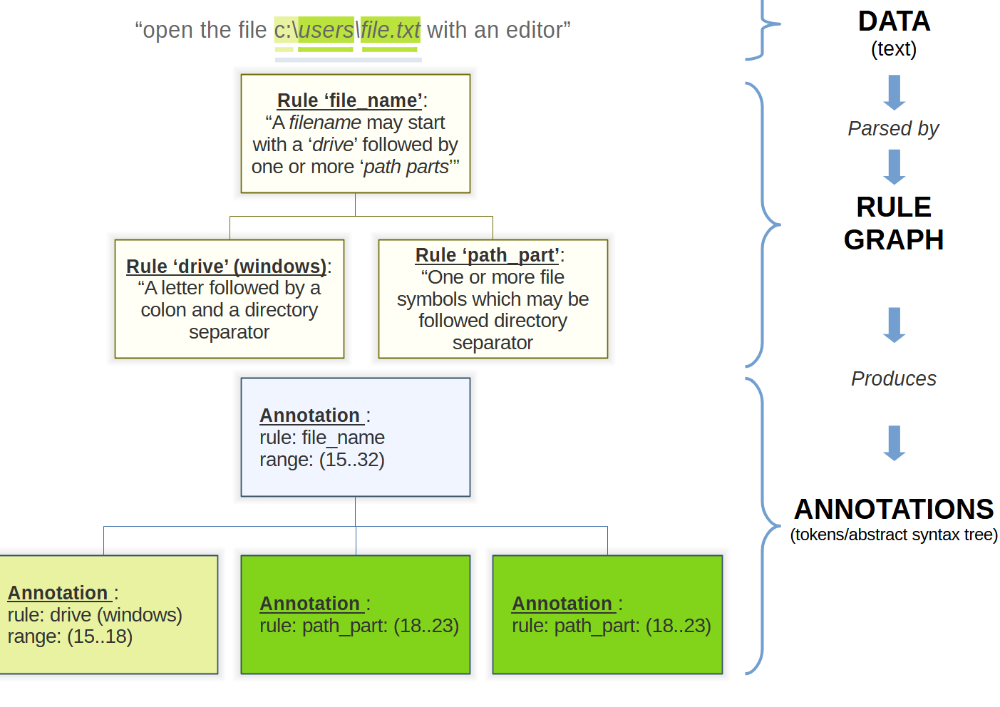

gg.parse 
=======================================================================================================================

!_Please Note_! the code base is under development and changes frequently. The documentation below may be out of date.

Quickstart
-----------------------------------------------------------------------------------------------------------------------

The goal of the gg.parse project is to provide a library for a tokenization, parsing and offer an ebnf-like scripting 
tools to make parsing of simple and complex data easy to do, both programatically and via an interpreted scripting 
language. Additionally the goal of this project is to provide an _easy to understand and use, light-weight_ framework.

Core concepts:

- A `_Rule_` implements a function to parse data (text) and create one or more `_Annotations_`.
- An `_Annotation_` describes what data is intended to mean, as expressed by a rule. An annotation describes a specific 
  part of the data by way of a `_Range_`. A range a position in the data and its length. Furthermore an annotation is a 
  tree-node where its children may give further insight in the details of data in question.
- A collection of `Rules` make up a `_Rule Graph_`. A `Rule Graph` can _parse_ data (commonly, but not necessarily 
  text)  and map the data to one or more `Annotations`. Depending on the use case, the collection of `Annotations` 
  can either be used as `Tokens` or an `Abstract Syntax Tree`.



Extended concepts:

- A set of common rules (literal, sequence, not...) to quickly build tokenizers and parsers. 
- A tokenizer/parser/compiler which can build a tokenizer and or parser based on a high-level ebnf-like script.
- A facade-like class, `gg.parse.script.ParserBuilder`, which combines all of the above in a single convenient class.

## Example

Programmatically create a tokenizer to tokenizer (simplified) filenames in a text (see 
`gg.parse.doc.examples.test\CreateFilenameTokenizer.cs`):

```csharp
        public class FilenameTokenizer : CommonTokenizer
        {
            public FilenameTokenizer()
            {
                var letter = OneOf(UpperCaseLetter(), LowerCaseLetter());
                var number = InRange('0', '9');
                var specialCharacters = InSet("_-~()[]{}+=@!#$%&'`.".ToArray());
                var separator = InSet("\\/".ToArray());
                var drive = Sequence("drive", letter, Literal(":"), separator);
                var pathPart = OneOrMore("path_part", OneOf(letter, number, specialCharacters));
                var pathChain = ZeroOrMore("#path_chain", Sequence("#path_chain_part", separator, pathPart));
                var path = Sequence("path", pathPart, pathChain);
                var filename = Sequence("filename", drive, path);
                var findFilename = Skip(filename, failOnEoF: false);

                Root = OneOrMore("#filenames", Sequence("#find_filename", findFilename, filename));
            }
        }

        ...

        var filename = "c:\\users\\text.txt";
        var data = $"find the filename {filename} in this line.";           
        var tokens = new FilenameTokenizer().Tokenize(data);
            
        IsTrue(tokens[0].GetText(data) == filename);

        IsTrue(tokens[0] == "filename");
        IsTrue(tokens[0][0] == "drive");
        IsTrue(tokens[0][1] == "path");
        IsTrue(tokens[0][1][0] == "path_part");
        IsTrue(tokens[0][1][1] == "path_part");
```

Doing the same using a script (see `gg.parse.doc.examples.test\CreateFilenameTokenizer.cs`):

```csharp

    public static readonly string _filenameScript =
        "#filenames         = +(find_filename, filename);\n" +
        "~find_filename     = >>> filename;\n" +
        "filename           = drive, path;\n" +
        "drive              = letter, ':', separator;\n" +
        "path               = path_part, *(~separator, path_part);\n" +
        "path_part          = +(letter | number | special_character);\n" +
        "letter             = {'a'..'z'} | {'A'..'Z'};\n" +
        "number             = {'0'..'9'};\n" +
        "separator          = {'\\\\/'};\n" +
        "special_character  = {\"_-~()[]{}+=@!#$%&`.'\"};\n";

    ...

    var filename = "c:\\users\\text.txt";
    var data = $"find the filename {filename} in this line.";
    var tokens = new ParserBuilder().From(_filenameScript).Tokenize(data);

    IsTrue(tokens[0].GetText(data) == filename);

    IsTrue(tokens[0] == "filename");
    IsTrue(tokens[0][0] == "drive");
    IsTrue(tokens[0][1] == "path");
    IsTrue(tokens[0][1][0] == "path_part");
    IsTrue(tokens[0][1][1] == "path_part");
```


## Extending the EBNF Parser

- Create a new rule class
- Optionally create a tokenname for the rule in `CommonTokenNames.cs`
- Optionally create a shorthand for the rule in `CommonRules.cs`
- Add the rule to the `EbnfTokenizer.cs` constructor
- Add the new tokens to the `EbnfTokenParser.cs` and create a matching function property
- Don't forget to add the matching function to `ruleTerms.RuleOptions` in the `EbnfTokenParser.cs` constructor
- Create a corresponding Compile rule in `CompilerFunctions.cs`
- Register this compile rule to the `RegisterTokenizerCompilerFunctions` / `RegisterGrammarCompilerFunctions`
 
Adding tests:

- Add a new `MyNewFunctionTest.cs` to the testproject `/rules` and perform the appropriate tests
- Add a new test method to `EbnfTokenizerTests.cs` to test token parsing.
- Add a new test method to `EbnfTokenParserTests.cs` to test token parsing or add it to `ParseRule_ExpectSucess`.
- Add a compiler test in `RuleCompilerTests.cs`
- Add an integration test, add the rule in an .ebnf, parse/compile and test.

Good to remember (FAQ?):
------------------------

- bug? Seems rule = #(a | b) or ~(...) is not parsing ? output operator issue with group?
    IS _AS INTENDED_... groups by definition are always transitive and any other.
-   Data functions, eg {'a'..'b'} ALWAYS have output `none` because have them annotated is just overhead (that is to say I can't think of a good use case at the moment).
    IT SHOULD have a clear error though, something like "found output rule without identifier".
- DO NOT DO THIS: Remove condition from log, it can be replaced with sequence(condition, log). No it can't because the log RANGE will NOT cover the preceding sequence.
- ScriptPipeline should also work without a script tokenizer ? No because the input of the parser are tokens
-   	- Have a sub category chaining where a broad category can be reduced to a smaller category without having to resort to overly complex parse rules
	    See arg parser where we can never match an identifier (easily) without doing away with the broader category "base_name". Initially this could have 
	    been overcome with more context to the arg_identifier but this still runs into problems when the context doesn't cover enough.
		Specialization is not going to solve this either, consider the following (File.grammar / arg.grammar)
			
			key=value
			is matched as a base_name (base file name) 
			this needs to be solved in the grammar ? it's both filename token but it can also a key value
				* keep key=value out of scope. It MUST be --key=value otherwise there is no resolution
